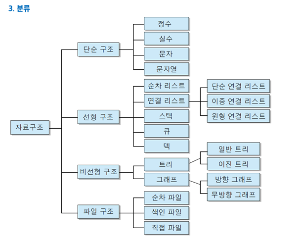

# 수선집 개발일기
### [Blog link 🤟](https://doubleflavor.github.io)

---

## Topics
- 자료구조
- 컴퓨터구조
- 알고리즘
- 네트워크
- 운영체제

---

## JANUARY

### 4주차
🍊[자료구조] 큐 (Queue)

### 3주차
🍊[자료구조] 연결리스트 (Linked List)

### 2주차
🍊[자료구조] 단순 구조 (정수, 실수, 문자, 문자열)

### 1주차
🍊[자료구조] 자료구조 기본개념 및 종류
